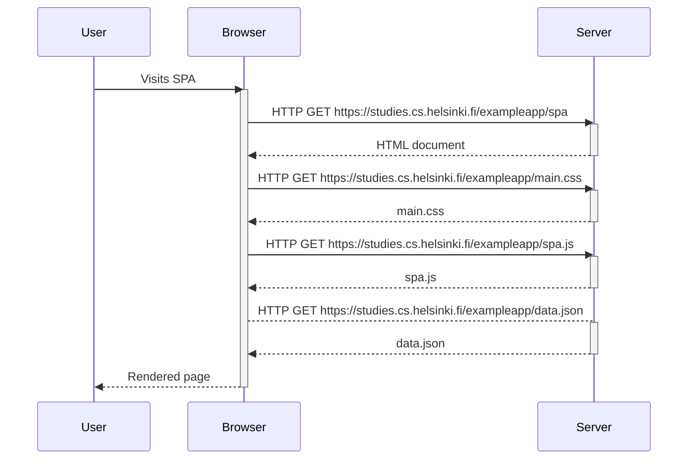

```mermaid
sequenceDiagram
    participant User
    participant Browser
    participant Server

    User->>Browser: Visits SPA

    activate Browser
    Browser->>Server: HTTP GET https://studies.cs.helsinki.fi/exampleapp/spa
    activate Server
    Server-->>Browser: HTML document
    deactivate Server

    Browser->>Server: HTTP GET https://studies.cs.helsinki.fi/exampleapp/main.css
    activate Server
    Server-->>Browser: main.css
    deactivate Server
    
    Browser->>Server: HTTP GET https://studies.cs.helsinki.fi/exampleapp/spa.js
    activate Server
    Server-->>Browser: spa.js
    deactivate Server

    Browser-->Server: HTTP GET https://studies.cs.helsinki.fi/exampleapp/data.json
    activate Server
    Server-->>Browser: data.json
    deactivate Server

    Browser-->>User: Rendered page
    deactivate Browser
```