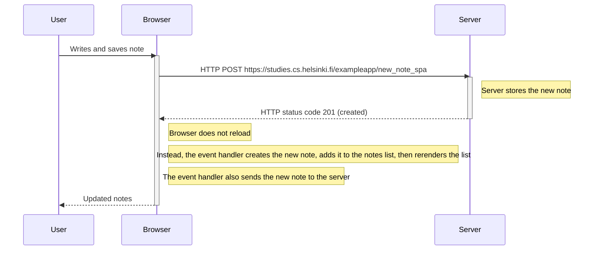

```mermaid
sequenceDiagram
    participant User
    participant Browser
    participant Server

    User->>Browser: Writes and saves note
    activate Browser
    Browser->>Server: HTTP POST https://studies.cs.helsinki.fi/exampleapp/new_note_spa
    activate Server
    Note right of Server: Server stores the new note
    Server-->>Browser: HTTP status code 201 (created)
    deactivate Server

    Note right of Browser: Browser does not reload
    Note right of Browser: Instead, the event handler creates the new note, adds it to the notes list, then rerenders the list
    Note right of Browser: The event handler also sends the new note to the server

    

    Browser-->>User: Updated notes
    deactivate Browser
```